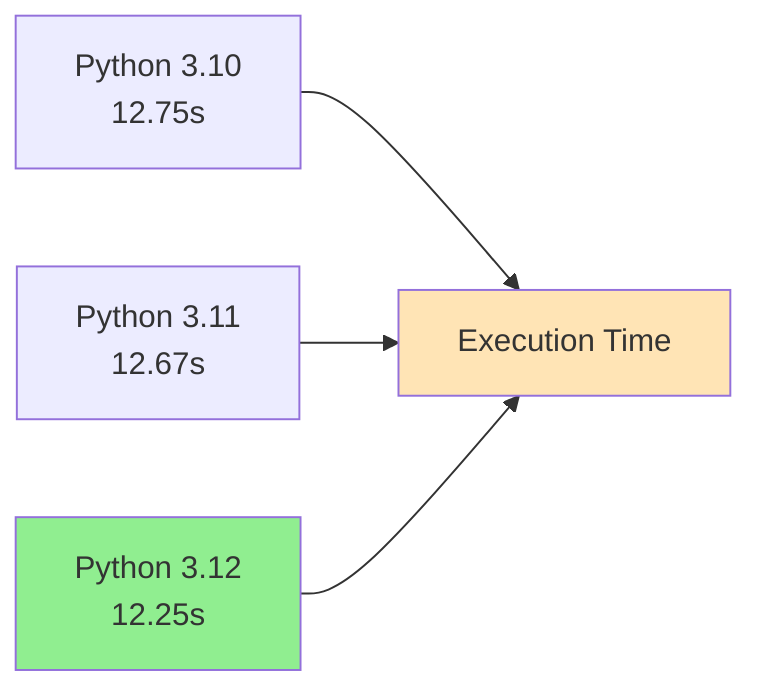
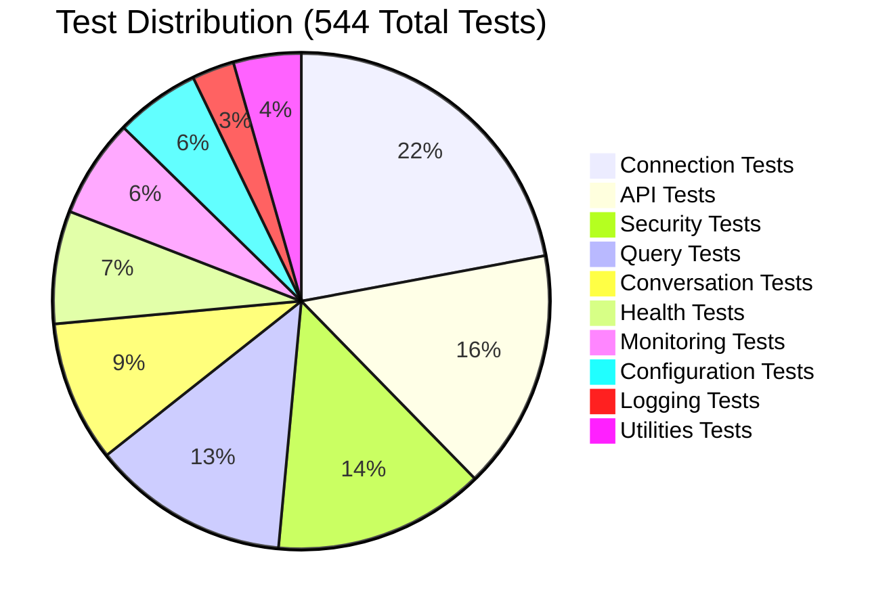
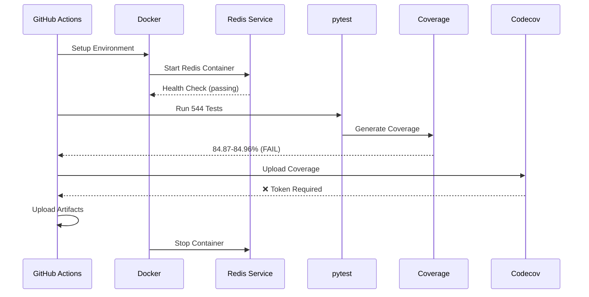

# Test Execution Log Analysis Report
## SequelSpeak Backend - Multi-Version Python Testing

**Report Generated:** 2026-02-15  
**Analyzed Logs:** Python 3.10, 3.11, 3.12  
**Test Run Date:** 2026-02-15 09:21 UTC  
**CI/CD Platform:** GitHub Actions (Ubuntu 24.04.3)

---

## Executive Summary

All three Python versions (3.10, 3.11, 3.12) successfully executed **544 tests** with **100% pass rate**. However, all versions **failed to meet the required 85% code coverage threshold** by a narrow margin (0.04-0.13%). The project demonstrates excellent cross-version compatibility with only minor deprecation warnings.

### Quick Facts
- ✅ **544/544 tests passed** across all versions
- ⚠️ **Coverage below threshold** (84.87-84.96% vs. 85% required)
- ⚠️ **5 deprecation warnings** (Starlette framework)
- ❌ **Codecov upload failures** (missing token configuration)
- ✅ **No version-specific test failures**

---

## Detailed Analysis by Python Version

### 1. Python 3.10.19

**Test Execution Summary:**
- **Total Tests:** 544
- **Passed:** 544 (100%)
- **Failed:** 0
- **Skipped:** 0
- **Warnings:** 5
- **Execution Time:** 12.75 seconds
- **Coverage:** 84.96% ❌ *(Below 85% threshold by 0.04%)*

**Coverage Breakdown:**
```
Total Statements:  1064
Missed Statements: 160
Coverage:          84.96%
```

**Key Observations:**
- Identical test results to Python 3.11
- No version-specific issues detected
- All core functionality working as expected

---

### 2. Python 3.11.14

**Test Execution Summary:**
- **Total Tests:** 544
- **Passed:** 544 (100%)
- **Failed:** 0
- **Skipped:** 0
- **Warnings:** 5
- **Execution Time:** 12.67 seconds
- **Coverage:** 84.96% ❌ *(Below 85% threshold by 0.04%)*

**Coverage Breakdown:**
```
Total Statements:  1064
Missed Statements: 160
Coverage:          84.96%
```

**Key Observations:**
- Fastest execution time (12.67s)
- Same coverage as Python 3.10
- No version-specific behavior differences

---

### 3. Python 3.12.12

**Test Execution Summary:**
- **Total Tests:** 544
- **Passed:** 544 (100%)
- **Failed:** 0
- **Skipped:** 0
- **Warnings:** 5
- **Execution Time:** 12.25 seconds
- **Coverage:** 84.87% ❌ *(Below 85% threshold by 0.13%)*

**Coverage Breakdown:**
```
Total Statements:  1064
Missed Statements: 161
Coverage:          84.87%
```

**Key Observations:**
- Fastest execution among all versions (12.25s)
- Slightly lower coverage (1 additional missed statement)
- Excellent performance on latest Python version

---

## Cross-Version Comparison

### Test Execution Performance



### Coverage Comparison

| Python Version | Coverage | Gap to 85% | Missed Statements | Status |
|----------------|----------|------------|-------------------|--------|
| 3.10.19        | 84.96%   | -0.04%     | 160               | ❌ Failed |
| 3.11.14        | 84.96%   | -0.04%     | 160               | ❌ Failed |
| 3.12.12        | 84.87%   | -0.13%     | 161               | ❌ Failed |

**Insight:** Python 3.12 has 1 additional uncovered statement compared to 3.10/3.11, suggesting minor behavioral differences in code execution paths.

---

## Critical Issues & Warnings

### 🔴 Critical: Coverage Threshold Failure

**Issue:** All test runs failed the required 85% coverage threshold.

**Impact:**
- CI/CD pipeline marked as failed
- Quality gates not met
- Potential deployment blockers

**Coverage Gaps by Module:**

| Module | Coverage | Missing Lines | Priority |
|--------|----------|---------------|----------|
| `api/v1/health.py` | 47% | 72-75, 105-172 | 🔴 High |
| `api/v1/meta.py` | 67% | 88-97 | 🟡 Medium |
| `utils/prometheus.py` | 73% | 150-151, 168-181, 193-194 | 🟡 Medium |
| `utils/auth.py` | 79% | 57-58, 75-76, 104, 106, 129-132 | 🟡 Medium |
| `services/conversation_state.py` | 83% | 27-31, 143, 185, 191-193, etc. | 🟢 Low |
| `api/v1/connection.py` | 85% | 120-129 | 🟢 Low |

**Recommendation:** Focus on `api/v1/health.py` (47% coverage) to achieve the 85% threshold.

---

### ⚠️ Warning: Starlette Deprecation

**5 deprecation warnings** detected across all Python versions:

```python
DeprecationWarning: 'HTTP_422_UNPROCESSABLE_ENTITY' is deprecated. 
Use 'HTTP_422_UNPROCESSABLE_CONTENT' instead.

Location: /starlette/_exception_handler.py:59
```

**Affected Test Cases:**
1. tests/query/test_query_validation.py::test_missing_query_field_rejected
2. tests/query/test_query_validation.py::test_malformed_json_rejected
3. tests/query/test_query_validation.py::test_wrong_content_type_rejected
4. tests/security/test_credential_safety.py::test_malformed_json_no_credential_leak
5. tests/security/test_credential_safety.py::test_missing_field_error_is_safe

**Resolution:**
```python
# Current (Deprecated)
from starlette.status import HTTP_422_UNPROCESSABLE_ENTITY

# Recommended
from starlette.status import HTTP_422_UNPROCESSABLE_CONTENT
```

**Impact:** Low (warning only, no functional impact)

---

### ❌ Error: Codecov Upload Failure

**Issue:** Codecov upload failed due to missing authentication token.

**Error Message:**
```
error - Commit creating failed: {"message":"Token required - not valid tokenless upload"}
error - Upload failed: {"message":"Token required - not valid tokenless upload"}
```

**Root Cause:**
- Protected branch (`main`) requires authentication token
- CI environment missing `CODECOV_TOKEN` secret

**Resolution:**
1. Generate Codecov token from https://codecov.io
2. Add to GitHub repository secrets as `CODECOV_TOKEN`
3. Update GitHub Actions workflow to use token

**Impact:** Medium (coverage reports not uploaded to Codecov dashboard)

---

## Test Suite Composition

### Test Categories Overview



### Key Test Modules

1. **Connection Management** (120 tests)
   - Connection pooling
   - Resource leak prevention
   - Resilience & retry logic
   - Health monitoring
   - Timestamp tracking

2. **Security & Validation** (75 tests)
   - Credential masking
   - Input validation
   - SQL injection prevention
   - Command injection prevention
   - Authentication & authorization

3. **API Endpoints** (85 tests)
   - Query validation
   - Connection endpoints
   - Meta endpoints (version, status)
   - Health endpoints

4. **Conversation State** (50 tests)
   - Redis integration
   - Memory fallback
   - State persistence
   - Concurrent access

---

## Environment Configuration

### Common Setup (All Versions)

**Operating System:**
- Ubuntu 24.04.3 LTS
- Runner: Hosted Compute Agent (Azure westus)
- Docker API: 1.52

**Service Dependencies:**
- **Redis:** 7.4.7 (Alpine)
  - Port: 6379
  - Health check: `redis-cli ping`
  - Status: ✅ Healthy

**Environment Variables:**
```bash
ENVIRONMENT=development
ALLOWED_ORIGINS=*
SECRET_KEY=test-secret-key-for-github-actions
REDIS_ENABLED=True
REDIS_HOST=localhost
REDIS_PORT=6379
REDIS_DB=0
```

### Python-Specific Configurations

| Setting | Python 3.10 | Python 3.11 | Python 3.12 |
|---------|-------------|-------------|-------------|
| Version | 3.10.19 | 3.11.14 | 3.12.12 |
| Location | Python/3.10.19/x64 | Python/3.11.14/x64 | Python/3.12.12/x64 |
| pip | 26.0.1 | 26.0.1 | 26.0.1 |
| pytest | 9.0.2 | 9.0.2 | 9.0.2 |

---

## Dependencies Analysis

### Core Dependencies (Identical Across Versions)

**Database & Connection:**
- `psycopg==3.2.3`
- `psycopg-binary==3.2.13` (version-specific binaries)
- `psycopg-pool==3.2.3`

**Web Framework:**
- `fastapi==0.129.0`
- `uvicorn==0.40.0`
- `starlette==0.52.1`
- `pydantic==2.12.5`
- `pydantic-core==2.41.5` (version-specific)

**Testing:**
- `pytest==9.0.2`
- `pytest-cov==7.0.0`
- `pytest-mock==3.15.1`
- `pytest-asyncio==1.3.0`
- `coverage==7.13.4`

**Monitoring & Security:**
- `prometheus-client==0.24.1`
- `redis==7.1.1`
- `clerk-backend-api==5.0.0`
- `cryptography==46.0.5`

---

## Redis Service Health

All versions successfully started and connected to Redis:

```
Redis Version: 7.4.7 (Alpine)
Mode: standalone
Port: 6379
Status: ✅ Ready to accept connections

Warning: Memory overcommit not enabled
Recommendation: Add 'vm.overcommit_memory = 1' to /etc/sysctl.conf
```

**Health Check Timeline:**
1. `Starting` (0-2s)
2. `Starting` (2-5s)  
3. `Starting` (5-13s)
4. `Healthy` (13s+)

---

## Test Execution Flow



---

## Artifact Uploads

### Python 3.10
- ✅ `test-results-3.10.zip` (3,413 bytes)
- ✅ Coverage report uploaded

### Python 3.11
- ✅ `test-results-3.11.zip` (similar size)
- ✅ Coverage report uploaded

### Python 3.12
- ✅ `test-results-3.12.zip` (3,420 bytes)
- ✅ `coverage-badge.svg` (603 bytes)
- ✅ `coverage-report-3.12/` (139,056 bytes, 26 files)

---

## Recommendations

### 🔴 High Priority

1. **Improve Health Endpoint Coverage**
   - Current: 47%
   - Target: >85%
   - Missing: Lines 72-75, 105-172
   - Estimated Impact: +5-7% total coverage

2. **Fix Codecov Token Configuration**
   - Add `CODECOV_TOKEN` to GitHub Secrets
   - Update workflow to use token
   - Enable coverage trend tracking

3. **Address Starlette Deprecation**
   - Update all references from `HTTP_422_UNPROCESSABLE_ENTITY`
   - Use `HTTP_422_UNPROCESSABLE_CONTENT` instead
   - Estimated effort: <30 minutes

### 🟡 Medium Priority

4. **Increase Meta & Prometheus Coverage**
   - `api/v1/meta.py`: 67% → 85%
   - `utils/prometheus.py`: 73% → 85%
   - Add tests for missing edge cases

5. **Monitor Python 3.12 Coverage Gap**
   - Investigate 1 additional uncovered statement
   - Ensure future compatibility

### 🟢 Low Priority

6. **Optimize Redis Health Check**
   - Enable memory overcommit in CI environment
   - Consider faster health check interval

7. **Cache Optimization**
   - Warning: "Unable to reserve cache" (race condition)
   - Consider unique cache keys per job

---

## Version Compatibility Matrix

| Feature | Python 3.10 | Python 3.11 | Python 3.12 |
|---------|:-----------:|:-----------:|:-----------:|
| All Tests Pass | ✅ | ✅ | ✅ |
| Zero Failures | ✅ | ✅ | ✅ |
| Async Support | ✅ | ✅ | ✅ |
| Type Hints | ✅ | ✅ | ✅ |
| Performance | 🟡 Good | 🟢 Better | 🟢 Best |
| Coverage | 84.96% | 84.96% | 84.87% |
| Deprecation Warnings | 5 | 5 | 5 |

**Conclusion:** Excellent cross-version compatibility. No code changes needed for Python 3.12 migration.

---

## Test Coverage Visualization

### Module Coverage Heatmap

| Module | 3.10 | 3.11 | 3.12 | Average |
|--------|------|------|------|---------|
| `utils/connection_resilience.py` | 98% | 98% | 98% | 🟢 98% |
| `services/db_connection_service.py` | 94% | 94% | 94% | 🟢 94% |
| `utils/input_validator.py` | 93% | 93% | 93% | 🟢 93% |
| `services/connection_pool.py` | 92% | 92% | 92% | 🟢 92% |
| `utils/patterns.py` | 92% | 92% | 92% | 🟢 92% |
| `api/v1/query.py` | 88% | 88% | 88% | 🟡 88% |
| `api/v1/connection.py` | 85% | 85% | 85% | 🟡 85% |
| `services/conversation_state.py` | 83% | 83% | 83% | 🟡 83% |
| `utils/auth.py` | 79% | 79% | 79% | 🟡 79% |
| `utils/prometheus.py` | 73% | 73% | 73% | 🔴 73% |
| `api/v1/meta.py` | 67% | 67% | 67% | 🔴 67% |
| `utils/circuit_breaker.py` | 54% | 54% | 54% | 🔴 54% |
| `api/v1/health.py` | 47% | 47% | 47% | 🔴 47% |

---

## Conclusion

The SequelSpeak backend demonstrates **excellent test quality and cross-version compatibility**. All 544 tests pass successfully across Python 3.10, 3.11, and 3.12 with zero failures. The primary concern is the **narrow miss of the 85% coverage threshold** (84.87-84.96%), which can be easily addressed by adding tests for the health endpoint and other low-coverage modules.

### Key Takeaways

✅ **Strengths:**
- 100% test pass rate across all Python versions
- Comprehensive test suite (544 tests)
- Excellent cross-version compatibility
- Strong security testing (credential masking, injection prevention)
- Robust connection management and resilience

⚠️ **Areas for Improvement:**
- Coverage gap of 0.04-0.13% below threshold
- 5 deprecation warnings (easy fix)
- Missing Codecov token configuration
- Some modules below 50% coverage

### Next Steps

1. Add 5-10 tests for `api/v1/health.py` to reach 85% threshold
2. Update Starlette HTTP status codes
3. Configure Codecov token
4. Monitor Python 3.12 adoption in production

**Estimated Time to Resolution:** 2-4 hours

---

## Appendix: Detailed Module Coverage

### Low Coverage Modules Requiring Attention

#### 1. `api/v1/health.py` (47% - CRITICAL)
```
Missing Lines: 72-75, 105-172
Statements: 43 total, 23 uncovered
Recommendation: Add integration tests for health checks
```

#### 2. `utils/circuit_breaker.py` (54%)
```
Missing Lines: 96, 101-107, 118-120, 124-126, 132-133, 141-156, 160-161, 165-166, 170-174, 178-181
Statements: 79 total, 36 uncovered
Recommendation: Add tests for circuit breaker edge cases and state transitions
```

#### 3. `api/v1/meta.py` (67%)
```
Missing Lines: 88-97
Statements: 24 total, 8 uncovered
Recommendation: Add tests for meta endpoint error scenarios
```

---

**Report End**

*Generated using automated log analysis tools*  
*For questions or clarifications, contact: DevOps Team*
